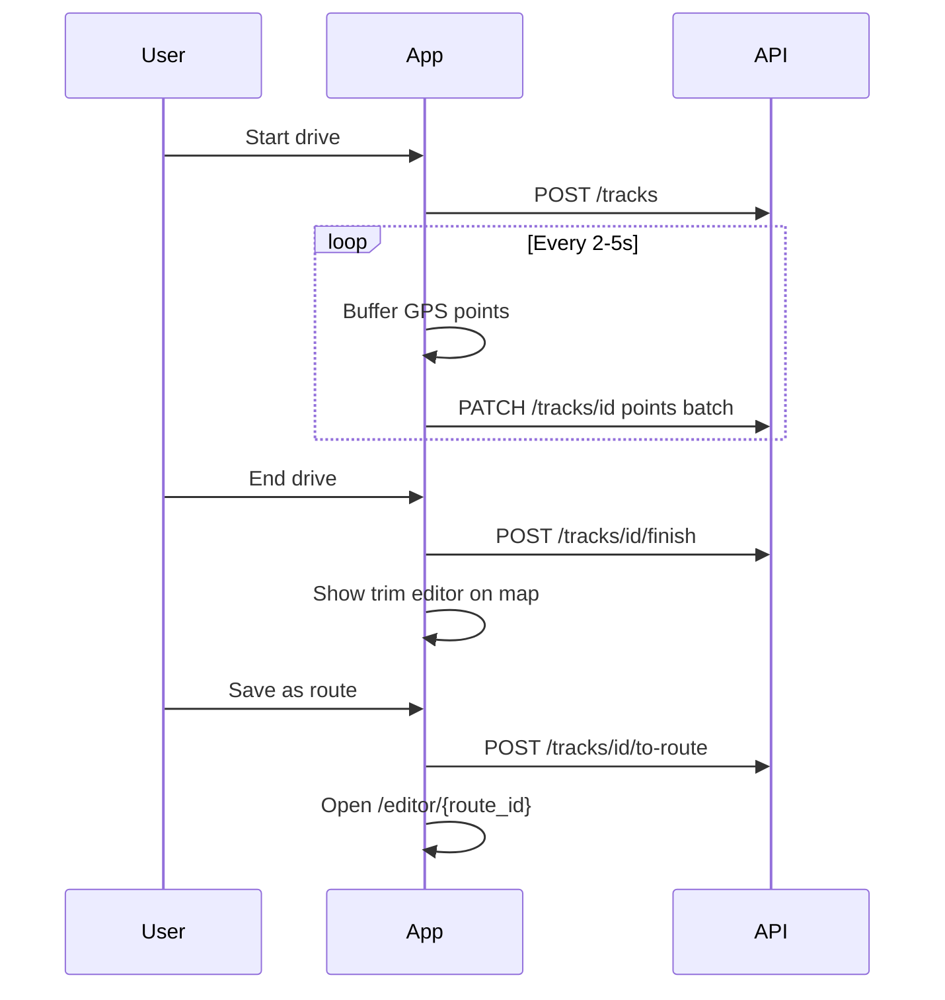

# Phase 2: Record-While-Driving — Design

## Problem

iOS restricts background GPS for web/PWA apps. Reliable drive recording needs a native shell (Expo/React Native or Capacitor) with `UIBackgroundModes` including `location`.

## Proposed API (backend)

### Track sessions

```
POST   /api/tracks              Start recording session
PATCH  /api/tracks/{id}         Append points batch or pause/resume
POST   /api/tracks/{id}/finish  End session, return raw track id
GET    /api/tracks/{id}         Get raw track (owner only until published)
```

**`Track` model**

| Field | Type | Notes |
|-------|------|-------|
| id | int | |
| owner_id | int | |
| status | enum | `recording`, `paused`, `finished` |
| started_at | datetime | |
| finished_at | datetime | nullable |
| point_count | int | |
| raw_geometry | LineString | full GPS trace |
| simplified_geometry | LineString | Douglas–Peucker simplified |

**`TrackPoint` (optional)** — store batches in JSONB on track or separate table for high-frequency data.

### Convert track → route

```
POST /api/tracks/{id}/to-route
Body: { start_index?, end_index?, title? }
```

Creates a `Route` with `source=recorded`, copies trimmed segment to stops/geometry, opens in standard editor.

### Privacy

- Client warns before publish; server documents trim endpoints.
- Default: finished tracks are private until user converts and publishes a route.

## Mobile shell options

| Option | Pros | Cons |
|--------|------|------|
| **Expo** | Background location module, OTA updates, maps | TypeScript/React learning |
| **Capacitor** | Reuse web UI, smaller native surface | Background GPS plugins need tuning |

**Recommendation:** Expo app in `mobile/` sharing API client types from OpenAPI. Reuse existing FastAPI backend unchanged.

## Client recording flow



## iOS entitlements (Expo)

```json
{
  "ios": {
    "infoPlist": {
      "UIBackgroundModes": ["location"],
      "NSLocationWhenInUseUsageDescription": "...",
      "NSLocationAlwaysAndWhenInUseUsageDescription": "..."
    }
  }
}
```

## Spike checklist

- [ ] Expo project `npx create-expo-app mobile`
- [ ] `expo-location` foreground + background task
- [ ] POST/PATCH track endpoints on backend
- [ ] Trim UI: draggable start/end handles on polyline
- [ ] Test 30+ minute drive on real iPhone

## Safety copy

- “Set up before you drive. Passengers can start recording.”
- “Pull over to edit your route.”
- No speed-based scoring in record mode.
