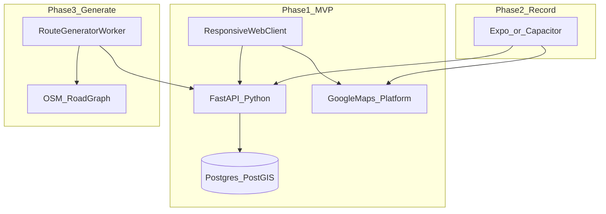
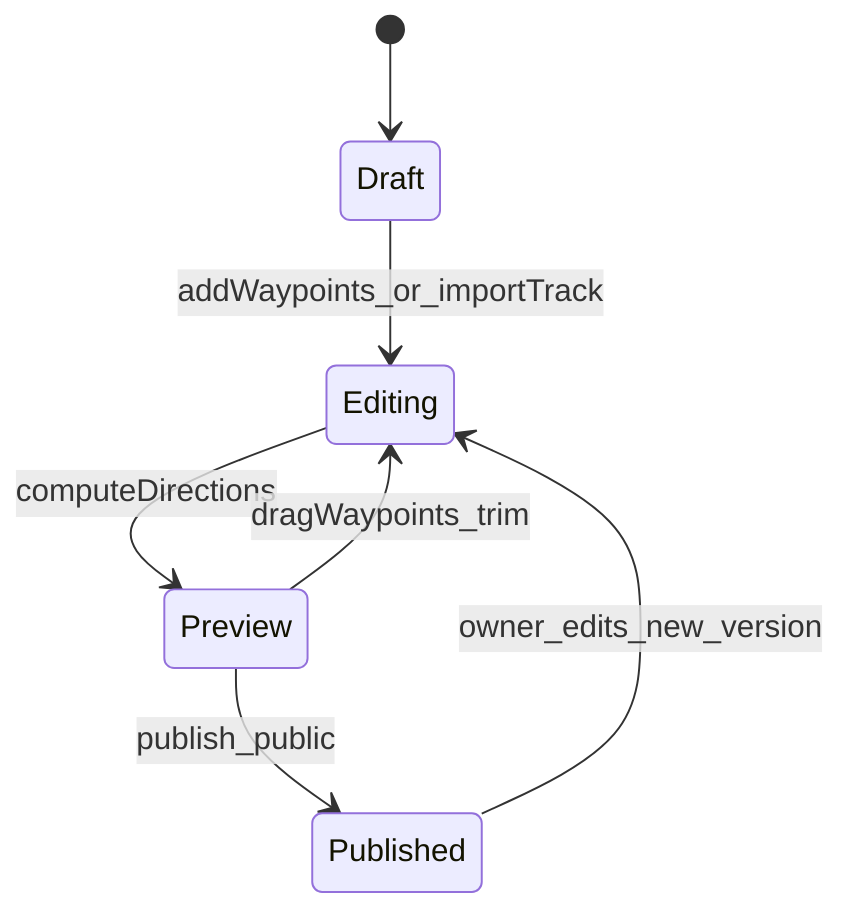

# Driving Route App — Product & Technical Plan

Greenfield driving-route app: ship create/edit/share on a map first (chosen MVP), with a Python API and a responsive web client that works well on iPhone. Defer background GPS recording and route generation to later phases, but design the data model and APIs so they plug in cleanly.

## Implementation todos

- [ ] Scaffold `backend/` (FastAPI + PostGIS) and `frontend/` (Vite React) with Docker Compose
- [ ] Build map route editor: waypoints, Directions build, draft/publish flow
- [ ] Add feed, ratings, comments, save/bookmark APIs and UI
- [ ] Server-side Directions/Places proxy, env docs, quota safeguards
- [ ] Document track-recording API + Expo/Capacitor spike before building record mode
- [ ] OSM graph + scoring spike in one bbox for generate mode

---

## Your stack question (short answer)

**A Python-only web app is a good fit for your MVP, but not as the whole long-term mobile story.**

| Approach | Create/edit routes on iPhone | Record while driving | Your Python strength |
|----------|------------------------------|----------------------|----------------------|
| Python backend + responsive web/PWA | Good | Poor on iOS (background GPS heavily restricted) | Excellent on server |
| Python backend + React Native (Expo) | Excellent | Excellent | Excellent on server |
| Python backend + web + Capacitor wrapper | Good | Better than PWA, still more work than RN | Excellent on server |

**Recommendation:** Build **Phase 1 as a responsive web app + Python API** (FastAPI). On iPhone it behaves like a site in Safari and can be “Add to Home Screen” as a light PWA. That matches your MVP (create, edit, share, discover) without learning Swift yet.

**Plan ahead for Phase 2:** When you add **record while driving**, add a **thin native shell** (Expo/React Native or Capacitor) mainly for reliable background location—not because Python was wrong, but because **iOS does not treat web apps like native apps for GPS**.



You stay **Python-first** where it matters: APIs, auth, social, storage, and (later) route-generation algorithms (`osmnx`, graph scoring, etc.). The client is a small amount of TypeScript for maps UX—not iPhone Swift.

---

## Product pillars (phased)

### Phase 1 — MVP: Create, edit, share, discover

**Create mode (manual)**

- Map-first editor: tap to add **waypoints/stops**, drag to reorder, optional name/photo/note per stop.
- Route line: use **Google Directions API** between waypoints (snap to drivable roads) *or* allow freehand sketch then **snap to roads** (Google Roads API / similar)—start with waypoints + directions; freehand is polish.
- Metadata: title, description, region, tags (e.g. `scenic`, `twisty`, `family`, `sunset`), difficulty vibe (subjective, not speed), estimated duration/distance.
- Privacy: **draft / unlisted / public** before publish.
- **Social lite:** public feed, search/filter by tags/region, star rating, short comments, “save to my library” (fork/copy route for personal edit).

**Explicitly out of MVP**

- Generate-from-criteria (stub UI OK, not required to ship).
- Background drive recording.
- Gamification / checkpoints.

### Phase 2 — Record mode

- Start/stop recording; sample GPS track (1–5 Hz), simplify polyline (Douglas–Peucker).
- Post-drive editor: trim start/end (privacy), split segment into new route, merge with manual waypoints.
- Requires **native or Capacitor** app with iOS background location entitlement and clear copy: “passenger sets up” / “park to edit.”

### Phase 3 — Generate mode

- Wizard: intent (scenic / twisty / relaxed cruise), anchor area, duration or distance band, optional “must pass near” point.
- Backend builds candidate routes from a **road graph** (OpenStreetMap via `osmnx` or hosted Valhalla/GraphHopper), scores edges, returns 1–3 options.
- Same editor as Create for tweaks.

### Phase 4 — Enrichment & gamification (later)

- POI layers (viewpoints, food, photo spots) via Places API + community pins.
- Road “personality” labels from OSM tags + curvature/speed-limit heuristics (not street racing).
- Safe gamification: badges for **routes completed**, **regions explored**, **community contributions**—no speed leaderboards.

---

## Core UX: route editor (shared across Create / Generate / Record)

One editor component powers all modes:



**Data model (store once, reuse everywhere)**

- `Route`: id, owner, title, description, tags, visibility, stats (distance, duration), source (`created` | `generated` | `recorded`), version.
- `RouteGeometry`: `LineString` (PostGIS) + optional ordered `Stop` points.
- `RouteVersion`: immutable snapshots after publish so comments/ratings stay attached to a stable route.
- Social: `Rating`, `Comment`, `Save` (bookmark), later `Completion` (honor system, no telematics proof in v1).

---

## Maps & APIs

**Google Maps Platform (aligns with your vision)**

- **Maps JavaScript API** (web): map, markers, polylines, mobile-friendly gestures.
- **Directions API**: drivable path between waypoints; driving options where needed.
- **Places API**: POI search and “points of interest” highlights in editor and route detail.
- **Geocoding**: search “near Asheville, NC”.
- **Roads API** (Phase 1.5): snap recorded or sketched paths to roads.

**Important constraints**

- Read [Google Maps Platform Terms](https://cloud.google.com/maps-platform/terms): store **your** route geometry and Places place IDs correctly; avoid caching forbidden assets long-term.
- Budget: enable APIs with quotas; Directions/Places are per-request—cache route geometry **you** compute after first build.

**Alternative to evaluate later:** Mapbox GL + Mapbox Directions often cheaper/flexible for custom “enthusiast” map styling; you can still keep Google Places for POIs. Not required for MVP if you prefer one vendor.

---

## Route generation (Phase 3 — how “label all roads” fits)

You do **not** need to pre-label every road manually for v1. Typical pipeline:

1. **Ingest** OSM for a bounding box (highway, surface, maxspeed, `motorcar=yes`, etc.).
2. **Score edges** per “profile” (e.g. scenic = low traffic tags + near water/green; twisty = high curvature metric from geometry).
3. **Solve** approximate path: target distance/duration ± tolerance (variable-length loop or point-to-point via constrained random walk / OR-Tools / custom heuristic).
4. **Return** GeoJSON + waypoints; client opens in same editor.

Python stack: `osmnx`, `networkx`, `shapely`, optional `ortools`. Run generation in a **background worker** (Celery/RQ) so API stays fast.

POI overlay in generate mode: query Places near candidate segments to explain *why* a route was suggested (“3 overlooks nearby”).

---

## Backend architecture (Python)

Suggested layout:

```
backend/
  app/
    main.py          # FastAPI
    api/             # routes, social, auth
    models/          # SQLAlchemy
    services/        # directions proxy, route builder
    workers/         # Phase 3 generation
frontend/
  src/
    components/MapRouteEditor/
    pages/ Feed, Editor, RouteDetail
```

| Layer | Choice | Why |
|-------|--------|-----|
| API | **FastAPI** | Async, OpenAPI, fits Python comfort |
| DB | **PostgreSQL + PostGIS** | Routes are geospatial first-class |
| Auth | **Supabase Auth** or **Clerk** | Fast social login on mobile web |
| Storage | S3/R2 for images | Stop photos, avatars |
| Hosting | Fly.io / Railway / Render + Vercel/Cloudflare for frontend | Simple solo deploy |

**API surface (MVP)**

- `POST /routes` — create draft
- `PATCH /routes/{id}` — waypoints, metadata
- `POST /routes/{id}/build` — call Directions, persist geometry
- `POST /routes/{id}/publish`
- `GET /routes/feed` — public, filters
- `POST /routes/{id}/ratings`, `GET/POST comments`
- `POST /routes/{id}/save` — bookmark

Proxy Directions/Places **through your backend** so API keys stay server-side and you can log/cache legally.

---

## Frontend (Phase 1)

**Vite + React + TypeScript** (minimal TS; maps libs are TS-friendly)

- Responsive layout: bottom sheet for stops on phone, side panel on desktop.
- `@react-google-maps/api` or Google Maps JS loader.
- Touch: large hit targets, undo for waypoint delete.
- Auth session → call FastAPI.

**iPhone experience tips**

- Safari viewport meta, safe-area insets, avoid hover-only UI.
- Optional PWA manifest for home-screen icon (not required day one).
- Test on real iPhone early; map gesture conflicts (scroll vs pan) are the main friction—not Python.

---

## Social & safety (design now, build lite in MVP)

- **Moderation hooks:** report route/comment; block user.
- **No speed contests** in schema or copy; ratings on “fun,” “scenery,” “road quality.”
- **Privacy defaults:** trim home area helper in Phase 2; in MVP warn “don’t publish exact home address.”
- **Terms:** user-generated routes; driving laws/disclaimer on first launch.

Gamification: reserve tables (`achievements`, `completions`) but **no UI** until core loop works.

---

## Suggested repo bootstrap (after plan approval)

1. `backend/` — FastAPI, PostGIS migrations (Alembic), env for Google keys.
2. `frontend/` — Vite React, map editor skeleton, feed page.
3. Docker Compose for local Postgres+PostGIS.
4. README: env vars, Google Cloud console setup, run scripts.

No native app repo until Phase 2; keep **shared OpenAPI client** so mobile shell reuses the same API.

---

## Risks & mitigations

| Risk | Mitigation |
|------|------------|
| Google API cost | Cache built geometry; debounce rebuild; quotas/alerts |
| Web GPS useless for recording | Defer record; design track import API early |
| “Fun road” generation quality | Start with 2–3 profiles + human-curated seed routes in one region |
| Solo scope creep | Ship one region/community seed content; single editor |

---

## What success looks like for MVP

A driver in Safari on iPhone can: build a 5-stop backroad route on Google Maps, preview drive time, publish with tags, and another user can find it, rate it, comment, and save a copy to tweak—without installing from the App Store.

## Next discussion topics

- Pick **auth provider** and first launch **region** (for seed content).
- Google Cloud project setup and monthly budget cap.
- Whether route lines are **waypoint-only** or **freehand + snap** in v1 (waypoint-only is faster to ship).
